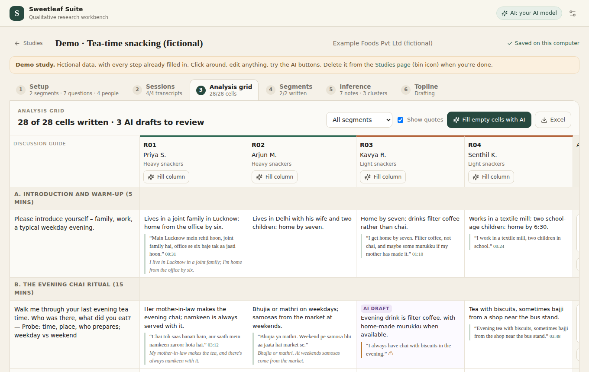
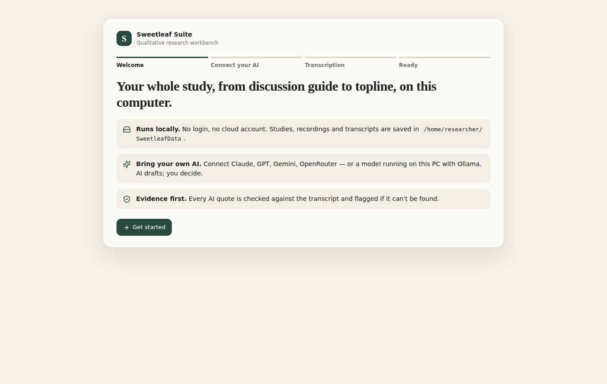
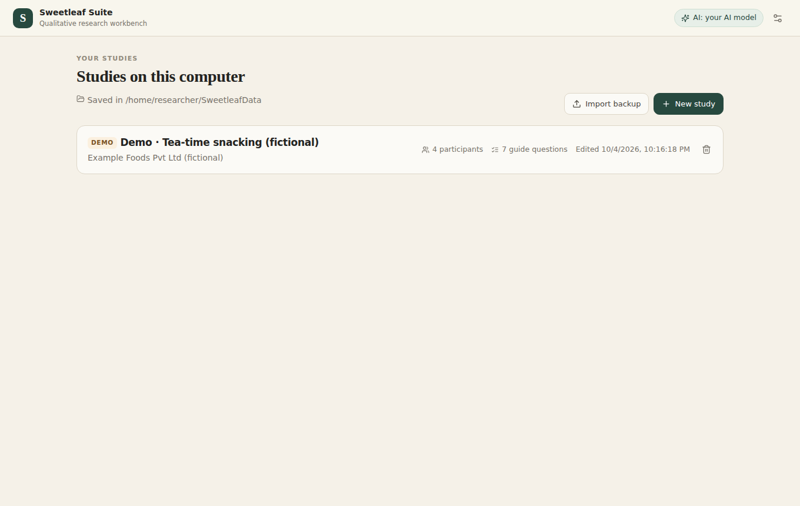
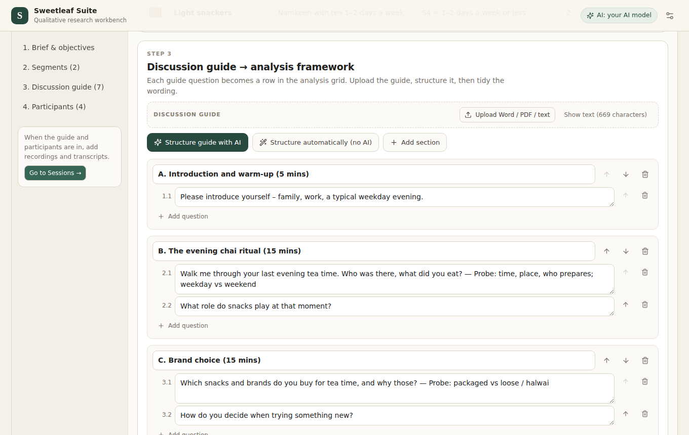
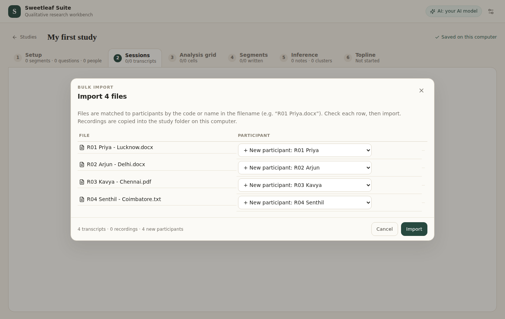
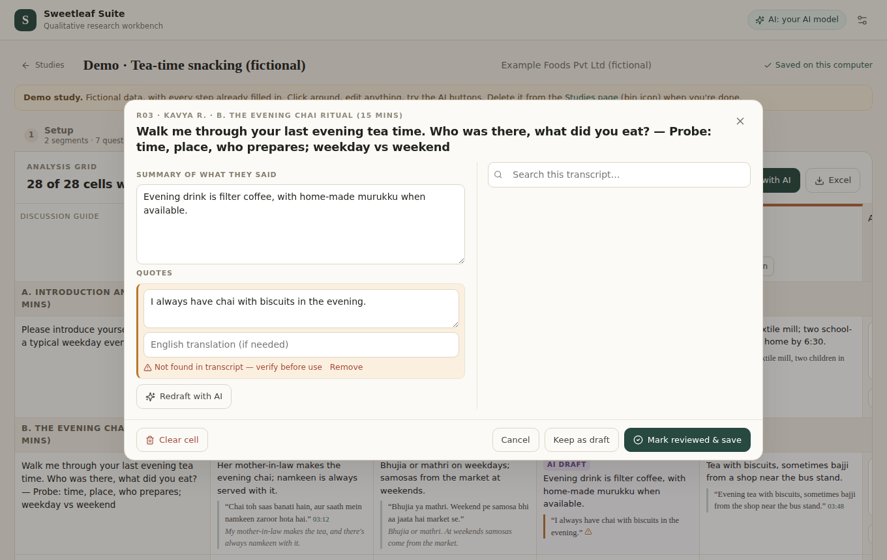

# Sweetleaf Suite

**A workbench for qualitative researchers.** Bring in your brief, screener, discussion guide, transcripts and recordings, and work through to an analysis grid, segment views and a topline, all in one place.

- **Runs on your own computer.** No login, no cloud account. Your files stay on your PC.
- **Works the way you already work.** The discussion guide becomes the rows of your analysis grid, respondents become the columns, and everything exports to Excel and Word.
- **AI is optional.** Connect your own AI to draft grid cells, summaries and the topline. Every quote it suggests is checked against the transcript.
- **Made for Indian research.** Hindi, Hinglish, Tamil and other languages, plus the transcript formats vendors here deliver.

---

## Download

### [⬇ Download Sweetleaf (ZIP)](https://github.com/theratbatbose/Sweetleaf-insights-suite/archive/refs/heads/main.zip)

Works on Windows and Mac. Free.

---

## Set it up (one time, about 10 minutes)

**1. Install Node.js.** Sweetleaf needs it to run.
- Go to **[nodejs.org](https://nodejs.org)** and click the big green **LTS** button.
- Open the downloaded file and click **Next** until it finishes.

**2. Unzip Sweetleaf.**
- Find the ZIP you downloaded, right-click it and choose **Extract All** (on a Mac, double-click it).
- Move the folder somewhere easy to find, such as **Documents**.

**3. Start Sweetleaf.**
- **Windows:** open the folder and double-click **`Start Sweetleaf.bat`**.
- **Mac:** right-click **`start-sweetleaf.command`** → **Open** → **Open**.

**What you'll see:**
- A black window opens. **The first time, it sets itself up for a few minutes.** Messages scroll past, and any that say `warn` are normal.
- When it's ready, it says **"Sweetleaf Suite is running at http://localhost:4317"** and your browser opens Sweetleaf.
- **Keep the black window open while you work.** Closing it turns Sweetleaf off.

**Every time after that:** just double-click the same file again. It starts in seconds.

---

## Try it in 5 minutes with the demo study

Sweetleaf comes with a **demo study**: a fictional four-interview study on tea-time snacking, with every step already filled in. Open it from your studies list and click through the six tabs:

| Tab | What to try |
|---|---|
| **1. Setup** | See how the discussion guide became a list of questions, and how participants and segments are set up. |
| **2. Sessions** | Read a transcript. Hover over a line and click the note icon on the right to log what you noticed. |
| **3. Analysis grid** | Click any cell to edit it. Look for the **amber quote**: that's the quote check catching an AI quote that isn't in the transcript. Click **Excel** to download the grid. |
| **4. Segments** | The cumulative view for each segment (cut). |
| **5. Inference** | Drag notes around, select some, and click **Cluster selected**. |
| **6. Topline** | The written story. Click **Word** to download it. |

**Done with it?** Go back to **Studies** and click the 🗑 bin icon on the demo. You can bring it back any time with **Add the demo study** at the bottom of the Studies page.

Want to practise importing files too? The **`examples`** folder inside Sweetleaf has the same study as Word, PDF, Excel and text files. Follow the steps below with those files.

---

## Use it for your own study

**1. Connect AI (optional).** Click the ⚙ icon at the top right → **AI model**. See *[Connecting AI](#connecting-ai-optional)* below.

**2. Create the study.** **Studies** → **New study** → give it a name.

**3. Setup tab:**
- **Brief:** click *Upload Word / PDF / text*, then **Fill fields from brief**.
- **Screener:** upload it, then **Detect segments from screener**.
- **Discussion guide:** upload it, then **Structure guide with AI** (or *Structure automatically*). Check the questions; these become your grid rows. You can edit, reorder or delete any of them.
- **Participants:** **Import recruitment list (Excel / CSV)**. Sweetleaf spots columns like *Resp ID, Name, Segment, City, Age*.

**4. Sessions tab → Bulk import.**
- Select **all your transcripts** (and recordings, if you have them) at once.
- Sweetleaf matches each file to a participant using the code or name in the file name, so name your files like **`R01 Priya.docx`** or **`R02 interview.mp4`**.
- Check the list, then click **Import**. If you haven't added participants yet, Sweetleaf creates them from the file names.

**5. Analysis grid tab.**
- Click **Fill empty cells with AI** (or write the cells yourself).
- Then **review**: click a cell to edit it, and check any **amber** quotes.
- **Synthesise row** writes the "across respondents" column.
- Click **Excel** to download the grid.

**6. Segments → Inference → Topline.** Draft each step with AI or write it yourself, then download the topline with **Word**.

Everything saves automatically. There's no Save button.

---

## Connecting AI (optional)

Sweetleaf works fully without AI. With AI, the slow parts get faster: structuring the guide, drafting grid cells, summarising segments and drafting the topline. You stay in charge, because AI drafts are marked and never overwrite your own writing.

**You need an "API key" from an AI company.** It's like a password that lets Sweetleaf use your AI account. You pay that company directly for what you use.

| Option | Where to get a key | Notes |
|---|---|---|
| **Claude** (Anthropic) | [console.anthropic.com](https://console.anthropic.com/settings/keys) | For analysis. Use OpenAI or Groq if you want automatic transcription. |
| **ChatGPT models** (OpenAI) | [platform.openai.com](https://platform.openai.com/api-keys) | Can also transcribe recordings |
| **Gemini** (Google) | [aistudio.google.com](https://aistudio.google.com/apikey) | **Turn on billing** for client work. On the free tier, Google may use what you send to improve its products. |
| **OpenRouter** | [openrouter.ai](https://openrouter.ai/keys) | One key for many AI models |
| **Ollama** | [ollama.com](https://ollama.com) | Runs on your own PC, so nothing leaves it. Needs a powerful computer. |

**How to connect:** ⚙ → **AI model** → pick a provider → paste the key → **Load models** → choose one → **Test connection** → **Save**.

Good to know:
- **A ChatGPT Plus or Claude Pro subscription is not an API key.** Those plans can't be used by other apps. You need a separate API account.
- **Paying from India:** use a card with international payments turned on, and add some prepaid credit before your first study.
- **Cost:** our rough estimate is **₹700–1,500 for a 20-interview study** (AI analysis plus automatic transcription). Prices change, so set a monthly spending limit in your provider's account.
- **Privacy:** when you click an AI button, the text it needs (for example one transcript) is sent to that company. Recordings are only sent if you use automatic transcription. Check this fits your client agreements and consent forms, or use Ollama.

**Automatic transcription** (optional) is set up separately: ⚙ → **Transcription**. If your transcripts come from a vendor, you don't need it.

---

## Everyday questions

**How do I stop Sweetleaf?** Close the black window.

**Where is my work saved?** In a folder called **`SweetleafData`** in your user folder (for example `C:\Users\YourName\SweetleafData`). It's separate from the app folder.

**How do I back up?** Copy the whole `SweetleafData` folder to a drive or cloud backup. To move one study to another computer, use **Topline → Study backup (.json)**, then **Import backup** on the other computer.

**How do I update to a new version?** Download the ZIP again, unzip it, and start it the same way. Your studies stay where they are. You can delete the old app folder.

**Can my team share a study?** Not yet. Each person runs Sweetleaf on their own computer. Share Excel and Word exports, or send a study backup file.

---

## Something not working?

| What you see | What to do |
|---|---|
| **"Windows protected your PC"** | Click **More info** → **Run anyway**. Windows shows this for any downloaded file. |
| **"How do you want to open this file?"** | Close it. Double-click **`Start Sweetleaf.bat`** again, or right-click it → **Open**. |
| **"Node.js is not installed"** | Do step 1 of setup, then try again. |
| **Lots of `npm warn` messages** | Normal. Wait. |
| **The browser didn't open** | Open Chrome or Edge and go to **localhost:4317**. |
| **"This site can't be reached"** | Sweetleaf isn't running. Double-click the start file and keep the black window open. |
| **A video won't play** | Use Chrome or Edge, or convert the video to MP4. It can still be transcribed. |
| **"API key was rejected" / "no credit"** | Paste the key again in ⚙ → AI model, or add credit in your AI provider's billing page. |
| **A file won't import** | Old `.doc` files: open in Word → *Save As* → `.docx`. Scanned PDFs: ask for the Word version. |

Still stuck? [Open an issue](https://github.com/theratbatbose/Sweetleaf-insights-suite/issues) with a screenshot.

---

## Files Sweetleaf can read

| What | Formats |
|---|---|
| Brief, screener, discussion guide | Word (.docx), PDF, text, or paste the text |
| Recruitment list | Excel (.xlsx) or CSV |
| Transcripts | Word, PDF, Excel, text, SRT, VTT (Zoom/Teams captions), CSV |
| Recordings | MP4, MOV, MKV, WEBM, MP3, M4A, WAV and other common formats |

Transcripts can be laid out in any of the usual ways: `Moderator: …` / `R1: …` / `Q:` and `A:`, the speaker's name on its own line, timestamps or none, or a Word table with *Time | Speaker | Dialogue* columns.

---

For developers: see [docs/DEVELOPERS.md](docs/DEVELOPERS.md).
